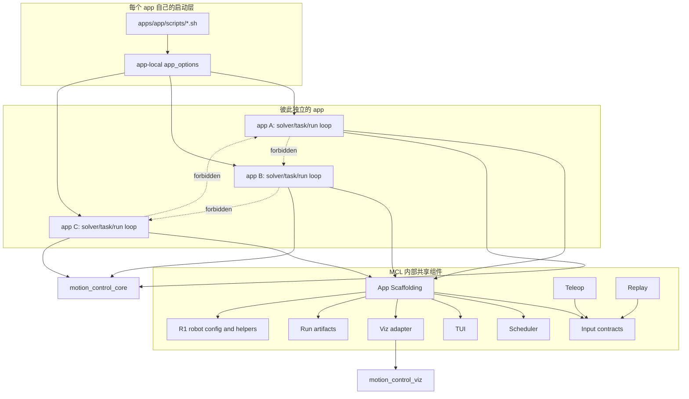
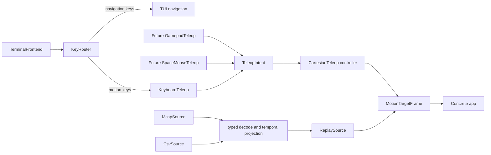
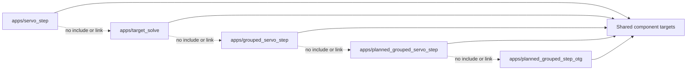

# Motion Control Lab 应用与组件契约架构

> 更新日期：2026-08-19
>
> 状态：目标架构。本轮只定义职责、依赖和迁移验收合同，不表示 Lab 已完成对应代码重构。

本文定义 Motion Control Lab（下文简称 MCL）的最终应用架构。
目标是让 TUI、Viz、调度、teleop 和 replay 成为可独立测试、可被所有 app 复用的
Lab 内部组件，同时保持每个 app 的算法语义和实验参数独立。

## 架构决策

1. MCL 仍是一个独立 CMake package。共享能力以 package 内部 CMake target 组织，
   当前不拆成多个 package，也不向工作区其他项目导出。
2. `apps/<app>/` 之间禁止 include、link 或调用。一个 app 的新增和修改不要求同步修改
   另一个 app。
3. 不建设统一 CLI、统一 `mcl` executable 或全局 option registry。每个 app 保留自己的
   `app_options.*`；推荐运行入口是 app 自己的 `scripts/*.sh`。
4. 建设薄的 App Scaffolding，但它不是统一 runner、app 基类或用 mode/callback 隐藏差异的
   业务框架。它只负责公共组件的装配、生命周期和构建样板。
5. TUI 只负责展示和 TUI 导航；键盘遥操作是独立 input adapter。以后新增 gamepad、
   SpaceMouse 或网络遥操作时，不修改 TUI。
6. MCAP 和 CSV 是同一个 replay 能力的不同物理 backend，不分别复制 replay clock、
   pause/step、timeline 或 EOS 状态机。
7. solver、task、constraint、规划/OTG 语义、主循环、诊断解释和 app 专属投影继续由具体
   app 拥有。共享组件不依赖具体 solver 类型。
8. TUI 和 Viz 都是可选输出。headless replay、batch 和测试路径不得依赖 FTXUI、Foxglove
   或网络端口。

## 总体依赖



依赖方向只有 `app -> shared components -> external components`。`motion_control_core`、
`motion_control_viz` 和共享组件都不得反向依赖任何具体 app。

## 输入架构

“输入”按语义分层，而不是把设备、文件格式和运行状态机揉成一个类。



### Input contracts

`motion_control_lab::input_contract` 只定义 app 消费的稳定数据：

- `MotionTargetFrame`：左右/单臂目标、logical time、revision 和来源；
- `InputStatus`：running、paused、end-of-stream、fault 等来源状态；
- `SourceControl`：pause、resume、step、stop 等通用控制意图；
- `TeleopIntent`：与设备无关的平移、旋转、选择臂和速度档位意图。

合同不包含 FTXUI event、MCAP record、CSV row、Foxglove message 或 MCC request。

### Keyboard teleop

`motion_control_lab::keyboard_teleop` 把归一化 `KeyEvent` 转成 `TeleopIntent` 或
`SourceControl`，不绘制界面、不维护 solver 状态，也不直接生成 MCC request。

`motion_control_lab::cartesian_teleop` 根据 `TeleopIntent`、当前 target 和时间增量生成
`MotionTargetFrame`。设备 adapter 与 target 积分器分开后，未来 teleop 实现只需要产生同一
`TeleopIntent`，无需复制 Cartesian target 状态机。

### Replay

`motion_control_lab::replay` 拥有一次且仅一次的 replay 状态机：timeline、clock、batch/
realtime、playback rate、pause/resume/step、EOS 和来源诊断。

- `McapSource` 只负责 MCAP 读取和 typed decode；
- `CsvSource` 只负责 CSV 读取和 typed decode；
- temporal validation、左右流 pairing、timestamp projection 和初始 JointState 映射保持为
  replay pipeline 的共享阶段；
- 两种 backend 最终都向 `ReplaySource` 提供相同 typed stream。

因此脚本可以叫 `run_mcap_replay.sh` 和 `run_csv_replay.sh`，但代码中不建立两套完整的
`mcap_replay`/`csv_replay` runner。

## 展示架构

### TUI

`motion_control_lab::tui` 接收通用 `TuiDocument`，只实现布局、页面、滚动、帮助和渲染。
它不知道 `TargetCommand`、solver backend、task handle、replay pairing 或 Foxglove。

每个 app 自己把 `AppSnapshot` 映射成 `TuiDocument`。这个 projector 属于
`apps/<app>/`，因为“哪个诊断重要、字段如何解释”是 app 语义；真正的 FTXUI 渲染实现只存在
一份。

`TerminalFrontend` 拥有 terminal session 和原始事件读取。`KeyRouter` 把导航键送到 TUI，
把运动键送到 `keyboard_teleop`。这样 `--ui none` 仍可在需要时使用键盘输入，而 TUI 也可以
在 replay 模式中只负责展示和 pause/step 控制。

### Viz

通用可视化合同和 transport 由 `motion_control_viz` 提供。MCL 只保留两类 adapter：

- 窄的公共 IK preview projector：把 solver-neutral 的 pose/FK/joint-state snapshot 转成
  `motion_control_viz::RenderBatch`；
- app-local projector：生成 planning request、OTG、collision 或其他 app 专属内容。

transport 的 WebSocket、MCAP 和 Null sink policy 可复用，但 app 不直接操作 Foxglove SDK。
headless 路径使用 Null sink，且不应因为 Viz 未构建而改变求解与 artifact 语义。

## Scheduler

`motion_control_lab::scheduler` 只提供 wall-clock/runtime 机制：

- single-rate tick；
- grouped periodic worker；
- deadline、overrun 和 skipped-release 统计；
- stop controller、mailbox 和线程 join；
- 可独立使用的 rate gate。

Scheduler 不读取键盘，不渲染 TUI，不发布 Viz，不加载 replay，也不认识 MCC group、solver
结果或 app 名称。各 app 决定有哪些 rate、哪个 tick 执行什么工作、deadline miss 是否 fatal，
并在 app-local 配置中保存这些策略。

## App Scaffolding

可以并且应该提供 scaffolding，但边界必须保持很薄。建议由两部分组成。

### Runtime scaffolding

`motion_control_lab::app_scaffold` 提供 `RuntimeServices` 风格的依赖集合和 RAII 生命周期：

- 接收 app 已经选好的 input source、scheduler、terminal、TUI、Viz sink 和 artifact writer；
- 统一执行 start、stop、close、join 等无业务语义的资源生命周期；
- 向 app 暴露这些组件的 typed reference；
- 保留第一个基础设施错误并按原错误失败，不吞异常、不自动降级。

它明确不做以下事情：

- 不解析 `argc/argv`，不选择 keyboard/MCAP/CSV；
- 不构造 MCC/PlaCo solver、task、constraint、planner 或 OTG；
- 不拥有统一 `run()` 主循环，也不通过 virtual callback 注册 app 行为；
- 不解释 accepted/rejected、scale、collision、fault hold 等算法状态；
- 不决定 rate、deadline policy、输出 topic 或 artifact 内容。

推荐的 app composition root 形状如下；这是职责示意，不是预先锁定的 C++ API：

```cpp
int main(int argc, char** argv) {
  const AppConfig config = parseAppOptions(argc, argv);  // app-local
  auto input = makeInputForThisApp(config);              // shared component
  auto runtime = AppScaffold::compose(
      makeRuntimeServices(config, std::move(input)));

  PlannedGroupedServoStepApp app(config, runtime.services());
  return app.run();                                      // app-local semantics
}
```

### Build and directory scaffolding

提供 `mcl_add_app(...)` 一类的 CMake helper 和 app 目录模板，用来统一 target 输出目录、install、
help smoke、组件依赖检查和脚本位置。模板不生成 solver/task 实现。

```text
apps/<app>/
  CMakeLists.txt
  main.cpp                 # composition root
  app.hpp / app.cpp        # solver, task, run loop and state transitions
  app_options.hpp / .cpp   # only this app's runtime options
  tui_projection.*         # AppSnapshot -> TuiDocument, when needed
  viz_projection.*         # AppSnapshot -> RenderBatch, when needed
  scripts/
    run_keyboard.sh
    run_mcap_replay.sh
    run_csv_replay.sh
  tests/
```

app 只创建并调用共享组件，不复制 FTXUI renderer、Foxglove transport、MCAP/CSV decoder、
replay clock 或 scheduler worker；但 app 会保留自己的算法和主循环代码，即使与另一个 app
局部相似。

## CMake 组件边界

建议最终收敛到以下 Lab 内部 targets。名称表示职责合同，实施时可按现有目录渐进迁移。

| Target | 唯一职责 | 禁止依赖 |
| --- | --- | --- |
| `motion_control_lab::input_contract` | target、intent、source status/control 类型 | FTXUI、MCAP、Viz、MCC |
| `motion_control_lab::scheduler` | tick、worker、deadline、mailbox、stop | input、TUI、Viz、replay、MCC |
| `motion_control_lab::terminal_frontend` | terminal session、归一化 KeyEvent | solver、replay、Viz |
| `motion_control_lab::keyboard_teleop` | KeyEvent 到 TeleopIntent/SourceControl | TUI renderer、solver、Viz |
| `motion_control_lab::cartesian_teleop` | TeleopIntent 到 MotionTargetFrame | 具体设备、TUI、solver |
| `motion_control_lab::tui` | TuiDocument 渲染与导航 | teleop、replay、solver、Viz |
| `motion_control_lab::data` | typed source、decoder、temporal pipeline | app、solver、TUI、Viz |
| `motion_control_lab::replay` | 单一 replay source 和 clock/state machine | app、solver、TUI、Viz |
| `motion_control_lab::run_artifacts` | manifest、status、trace 元数据和 hash | TUI、Viz、solver policy |
| `motion_control_lab::preview_projection` | 通用 IK snapshot 到 RenderBatch | transport、app-specific state |
| `motion_control_lab::preview_transport` | WebSocket/MCAP/Null sink 选择和生命周期 | solver、teleop、replay |
| `motion_control_lab::r1_robot_config` | 固定 joint/frame/TCP/default pose | app policy、solver/task config |
| `motion_control_lab::app_helpers` | 无业务语义的机械转换 | 具体 app、solver/task policy |
| `motion_control_lab::app_scaffold` | typed services、RAII、CMake/目录样板 | CLI、solver/task、统一 run loop |

这些 target 是 MCL 内部 implementation detail。不要让根仓、生产 SynRobot 或
`motion_control_core` 依赖它们。

## App 所有权与隔离

每个具体 app 必须拥有：

- solver implementation/backend 和 solve mode；
- task、constraint、gain、weight、mask、enforcement 和 hierarchy；
- planner/OTG/collision 的算法策略；
- app rate、deadline policy、fault/rejection 解释和状态转换；
- app-local `AppConfig`、默认值和 option parser；
- `AppSnapshot -> TuiDocument/RenderBatch` 的语义投影；
- 本 app 的 run artifact 内容和实验解释。

共享 `r1_robot_config` 只保存固定 R1 joint、frame、TCP 和默认 pose。production-static
baseline 的冻结 solver/task/rate/profile 参数继续位于 `apps/baseline/`，不开放 runtime
override，也不因其他 app 的实验需求改变。

禁止以下依赖：



若一段 solver/task 逻辑只被同一个 app 的 executable 和测试使用，可以建立
`mcl_<app>_support` target，但源文件必须留在该 app 目录，其他 app 不得链接它。

## Bash 启动与 runtime override

不增加统一 CLI。用户面对的是每个 app 自己的脚本，例如：

```text
apps/planned_grouped_servo_step/scripts/run_keyboard.sh
apps/planned_grouped_servo_step/scripts/run_mcap_replay.sh
apps/planned_grouped_servo_step/scripts/run_csv_replay.sh
```

脚本负责表达可读、可审查的实验 preset：

- binary、URDF、input/topic 和 output root；
- `LD_LIBRARY_PATH` 等本机运行环境；
- `chrt`、`taskset`、CPU mask 和 realtime priority 等 OS policy；
- 本 app 的推荐 rate、deadline、solver 和 planner/OTG 参数；
- 把 `"$@"` 原样放在命令末尾，允许一次运行覆盖脚本默认参数。

每个 executable 只解析自己的参数。共享组件接收 typed config，不接收 `argc/argv`，也不从
全局环境隐式读取算法参数。参数优先级为：

```text
app compiled defaults < script preset/environment < script trailing explicit arguments
```

为了支持 experiment，除 production-static baseline 外，下列关键参数应能被本 app 的脚本/
本地 flags 在 runtime 覆盖：solver/backend、tolerance、iteration、regularization、task
gain/weight/enforcement/mask、collision 参数、planning/OTG limits、worker rate、deadline policy
以及 UI/Viz/replay/output 选择。固定 R1 joint/frame/TCP 和生产 profile identity 不可覆盖。

这是一组跨 app 的脚本约定，不是统一 parser。不同 app 可以拥有不同参数；脚本不得通过向
所有 binary 填充无效 flag 来伪造一致性。产生实验 artifact 的 run 应保存最终解析后的配置、
原始 argv、脚本路径或版本以及输入 hash。

## App 类型与 source 能力

首轮迁移保持现有 app 能力，不为了统一外观给所有 app 强行增加所有 source：

| App 类别 | 目标 source | 说明 |
| --- | --- | --- |
| single-arm ServoStep、TargetSolve | keyboard teleop | 保留各自 ordinary solver 语义 |
| ServoStep、Grouped、Planned、OTG | keyboard teleop、MCAP replay、CSV replay | 三种输入最终进入同一 MotionTargetFrame contract |
| production-static baseline | keyboard teleop、MCAP replay、CSV replay | 算法与生产配置冻结 |
| Cartesian planning | JSON request | 不伪装成 teleop/replay app |
| replay-plan | headless MCAP/CSV | 只检查 timeline 和 artifact，不运行 solver |
| E03 batch | batch MCAP replay | 复用 ReplaySource，批处理与失败隔离留在 E03 orchestration |

## 目标目录

```text
motion-control-lab/
  contracts/
    input/
    presentation/
    runtime/
  components/
    app_scaffold/
    scheduler/
    terminal_frontend/
    tui/
    teleop/
      keyboard/
      cartesian/
    replay/
    visualization/
    run_artifacts/
    robot/r1/
  adapters/
    data/mcap/
    data/csv/
    visualization/
  apps/
    common/                  # 迁移期目录；最终由窄 component targets 取代
    <app>/
  experiments/
  analyses/
```

目录名可以在实施时微调，但 component target 的依赖合同不能退化为新的大而全
`interactive_runtime` 或 `app_common`。

## 验收合同

代码迁移完成时至少满足：

1. CMake/静态检查证明任何 `apps/<a>` 都不 include 或 link `apps/<b>`。
2. Scheduler、keyboard teleop、replay、TUI 和 Viz adapter 各自有不启动 solver 的单元测试。
3. keyboard teleop 用 synthetic `KeyEvent` 测试；TUI 测试只验证 document render/navigation。
4. 同一 canonical 数据通过 MCAP/CSV backend 产生等价 `MotionTargetFrame` 和 replay control
   行为。
5. headless replay/batch 在未构建 FTXUI 和 Foxglove transport 时仍能构建和运行。
6. 每个 app 的 `scripts/*.sh` 可独立运行对应 binary，并允许 runtime override；没有统一 CLI
   依赖。
7. App Scaffolding 不出现 solver/task 类型、app mode enum、统一 business callback 或算法
   状态解释。
8. 删除或拆分现有过宽的 `interactive_runtime`、`app_common` 后，不再有等价的大聚合 target
   以新名字回归。
9. production-static baseline 的冻结参数仍不可覆盖，且其 resolved config/artifact 可审计。
10. 更新 Lab README、`apps/AGENTS.md`、CMake dependency tests 和各 app 脚本后，再把本文状态
    从“目标架构”改为“已实施”。
