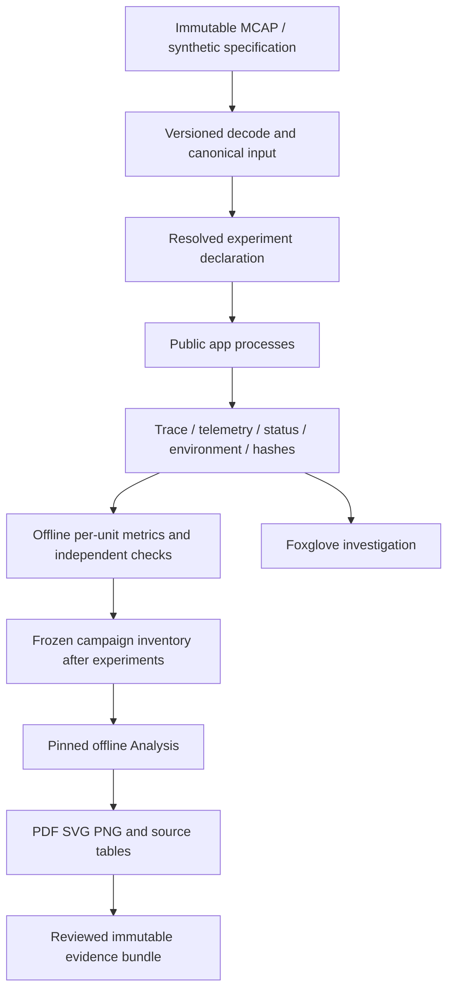

# 数据、统计与产物合同

状态：实验证据合同及 A01/A02 探索性分析已实现；正式统计与 A03 deferred。版本：`study-data.v1`。数学和指标定义引用 [PROTOCOL](PROTOCOL.md)，本文件拥有数据身份、时钟、统计和存储规则。

本文维护数据与统计规则；实际实现和阶段状态统一见 [研究索引](README.md)。分析必须消费已结束且来源固定的批次；旧 A01/A02 探索性结果不自动适用于新应用方法。正式统计及 A03 的协议要求保留。

## 1. 数据流与职责



输入解码、配对、重采样不得隐藏在 solver 内。C++ 负责被测执行；Python 负责输入准备及独立离线核验，实验结束后再承担跨 run 配对统计和制图。通用 orchestrator 只选择并启动独立执行单元，不拥有任务或 solver 配置。现有 app 的 source/planning/solver/loop 归属不改变。

复用 [typed replay](../app_component_architecture.md)、[telemetry](../foxglove_mcl_telemetry_contract.md)、[E05 外围隔离](../../experiments/E05_real_scene_planned_mcap_batch_replay/README.md) 的合同与机械能力；不得 import app-private launcher recipe 或根仓 benchmark 内部包。

## 2. 来源、转换与冻结

raw MCAP 保留原字节。外部目录只保存 locator、相对路径、SHA-256、size、来源说明，不自动复制视频或整批大文件。2026-09-10 的 50 文件盘点不是已冻结 dataset，正式流程重新枚举且生成输入清单。

synthetic 输入保存 generator version/hash、seed、全部参数和生成后的 canonical hash。可达目标优先由已知关节状态 FK 产生；困难场景保存它与可达基准的差异。测试用 fake 数据有 fixture 标签，不能进入正式证据索引。

转换声明记录 topic/schema、timestamp source、frame、joint order、单位、裁剪、配对容差、异常/缺失处理以及是否插值。原始 header/log/publish time 都保留 provenance。先按原时间配对再 retime；现有 fixed-period 是一对一 retime，不等于插值。resampling 另立 transform，注明旋转插值及因果性；未来样本不能悄悄进入在线 reference。

不同格式解码到相同 canonical 语义应产生相同数值序列；不声称跨平台浮点逐 bit 一致。模型/mesh、TCP 和 full/active 映射必须绑定 hash。canonical 输入冻结为独立资产，不随某个方法输出改变。

## 3. 三种时间与状态

| 时间 | 用途 | 禁止混用 |
|---|---|---|
| source logical time | 原始动作顺序、语义配对、输入重放 | 不能用旧录制时间计算本次延迟 |
| run monotonic time | 同 run worker 时序、耗时、参考年龄和 deadline | 不与不同 run 的数值直接相减 |
| wall event / emit time | MCAP/Foxglove事件定位、传输等待 | emit−event 不是 IK 求解耗时 |

每条 attempt 最少关联 input sequence、state sequence、task revision、attempt sequence、计划 release、实际开始/完成、proposal revision、proposal creation time、proposal capture state time 和 committed sequence。严格逐 tick 的误差使用原子 tracking record，不能任意拼接 latest-pose topics。

snapshot 模式：每个方法读取同一冻结 q/qdot/target，不把自身输出反馈成下一输入。用于 E06 和 E09 的受控比较。

evolving 模式：各方法从相同初始状态独立演化；默认实验 plant 是明确的运动学积分或 post-OTG committed state，不是物理动力学。reference period、feedback sampling、feedback age、solver period 和 output period 独立记录。命令作下一状态只在显式理想模型中允许；录制的生产 q 可作初始化或 snapshot 来源，不能当作所有方法唯一 ground truth。

realtime 与 deterministic virtual schedule 是独立执行模式。虚拟多频率 schedule 固定事件顺序以检查语义；真实线程结果不要求 bitwise deterministic，用重复运行度量。暂停会改变调度和输入语义，含人工暂停的运行只能用于诊断，不能混入正式 uninterrupted timing。

## 4. 身份与机器接口

当前 A01/A02 已消费关闭的开发批次。新增 `analysis.v1` 和 `run_manifest.v3`，保留 experiment manifest v1/v2 的读取行为，不迁移旧文件。具体来源和实际验收见 [分析验收](../archive/study/ANALYSIS_ACCEPTANCE.md)。以下保留协议身份要求：

- experiment.v1 继续表达实验基本定义，若字段变化需明确新版本；每个执行声明必须引用实际存在的 inputs descriptor 和冻结内容。
- analysis.v1 声明：analysis_id、精确 source run/result/manifest hashes、selection、配对键、统计方法、指标版本、允许 partial/dirty 来源的政策和输出要求。
- 新增 run_manifest.v3 按 run_kind 区分 experiment_id(E##) 与 analysis_id(A##)，不为 Analysis 伪造 E##。既有 experiment v1/v2 reader 及文件保留不变。Analysis manifest 记录输出哈希、代码和依赖身份、明确来源状态政策及探索性限制。
- metric_row.v2 保留旧 value/unit/role/status 含义，增加可审计的 run_id、experiment_id、case_id、method_id、arm_id、repeat_id、session_id、split_id、window_id 与 component identity。字段缺失用明确状态，不推断为另一方法/会话。
- 成对统计主键是同 experiment/case/input hash/model hash/window/repeat condition 的 baseline/candidate；session 用于聚类，不把不同 target windows 误配。

validate_contracts.py 已支持现役公开执行声明、analysis.v1/v2 和相应 manifest。精确字段以 contracts 中的版本化 schema 及读取器为准；不改写旧文件或将旧方法自动准入为新方法。

## 5. Artifact 生命周期

```text
experiments/<experiment>/runs/<run-id>/
  manifest.json
  definition/resolved.json
  inputs/inventory.json
  units/<case>/<arm>/<repeat>/
    command.json
    environment.json
    status.json
    trace.csv
    telemetry.mcap            # observation profile 要求时
    console.log
  evaluation/{metrics.csv,failures.json}

analyses/<analysis>/runs/<analysis-run-id>/
  manifest.json
  sources/inventory.json
  combined/decoded.parquet    # 可重建缓存，较大表按需生成
  evaluation/{paired_rows.csv,decision_tables.csv,validation.json}
  figures/
  report.md
  report.html
```

run-id 采用 UTC 时间与 resolved declaration hash 前缀；目录原子新建，拒绝覆盖。running manifest 仅在当前运行收尾时原子完成；完成后不可变。中断保留部分文件与 interrupted 状态，不伪造缺失 trace 或输入 hash。

记录 Lab/Core/vendored source 指纹、dirty 文件的可复现补丁或内容 hashes、实际 executable/动态库 hashes、编译器/选项、CPU/内核/调度环境、命令和相关显式环境变量。只收集执行所需配置，不转储整套进程环境或凭据。仅 dirty=true 或仅 Git HEAD 不足以复现。

所有 sources 和 outputs 记录哈希、大小、schema/metric version；Analysis 固定具体 run/result，禁止 latest。图风格更新、指标算法变更或配对政策变更产生新 Analysis，不改旧证据。结果经科学复核才进入 results；当前只有 .gitkeep，不创建虚构 result ID。

原始 trace/MCAP 是执行证据，Parquet 是解码缓存，CSV 是可交换指标和配对表。指标计算只有一个权威实现；renderer 只消费冻结表，不从图形对象反推统计。数据量增长时按 unit 分区和顺序处理，不要求整批 MCAP 常驻内存。

## 6. 分组、调参和统计

分组单位为采集 session；同一会话相邻片段、派生视图、左右流、重叠窗口不可跨 split。先按 metadata/采集记录确认 session；来源不足的文件保守合并成一组或排除出泛化主张，记录原因，不能自动视为独立会话。

初始 split 规则：规范 session_id 以 SHA-256(seed=20260910, session_id) 稳定排序，组数 n≥5 时取 floor(0.6n) development、floor(0.2n) tuning、其余 holdout；不按方法成绩分层。n<5 时不声称独立会话泛化，仅做案例研究，并标记 C6 evidence-insufficient。内容去重/重叠发现后在正式前重新分组与冻结，不改写旧 split。

已被人工用于开发/调参的会话不能再作为未见保留集；在 inventory 标记 exposure。若所有已有数据已暴露，E12 的当前批次只能做录制案例验证，真正 holdout 需新的未暴露会话。不能用新划分“洗掉”历史暴露。

每个合成 case 先做配对效果，再跨 case 汇总。真实动作先求每动作结果，再在 session 内聚合，使长录制不自动获得更多权重。主要效果报告绝对差、允许时的相对差、每组结果及 95% CI。默认 bootstrap 10000 次、seed 20260910；真实数据按 session 成组重采样，合成数据按独立 case/seed 重采样，重复进程嵌套于 case。单个会话不给伪造的会话级 CI，报告描述性结果。

确认性结论按预先声明的 primary/guardrail 判断；多指标不临时挑显著者。默认不作 p 值排名；若新协议引入显著性检验，须在正式前登记检验族和多重比较方法。探索性扫描明确标 exploratory。

配对 arm 失败/缺失时，paired effect 保持 unavailable，coverage/失败总表仍保留该单元。可以另给完整配对上的条件性效果，但注明其分母并与所有 required 单元覆盖率一起展示。不能给失败虚构无限误差来混成普通平均，也不能删除失败后说所有动作改善。

## 7. 时间分位数和窗口

默认开发 timing 用 cold first call + 固定 100 次 warm-up + 1000 次 measured calls，3 个新进程重复；formal 起点为 10 个进程重复、每次至少 10000 次 measured calls。E10 的持续时间见其实验协议。正式前冻结实际样本/时长预算；这些值是采样政策，不是硬实时认证标准。

原始样本 Pp 为排序后第 ceil(pN) 项；若只保存直方图，则报告桶宽与分位桶上界，不能混称 exact quantile。不平均各文件 P99 当成总体 P99；可汇合兼容原始样本/直方图得到样本加权总体，另列每 run 和每 session 结果。实测 max 同时标 N 和总观测时长。

runtime miss 分母是计划 release，包括 skipped。严格运行提前失败后，未运行后缀记 not-run，另报 time-to-failure 和完整计划窗口完成率，不能将失败前无 miss 窗口当成全程合格。rejected/HOLD 时段也保留已执行状态的跟踪误差。

大规模正式输出可使用固定容量非阻塞计时缓冲及运行后落盘；overflow 数量必须记录。timing trace 不完整时其高精度尾部统计 unavailable，仍保留原生计数。telemetry drop 与算法 rejection 分开。

## 8. 分阶段数据质量和生成验收

实验交付精确 locators、hashes、字段、required 单元及实际状态的 evidence inventory。已有 A01/A02 renderer 只处理固定非 RT 来源；正式统计和论文 evidence index 仍需独立验收。所有正式评价规则在看到正式结果前固定。

- 独立校验模型/frame/joint mapping、时间单调、哈希、row count、单位与执行窗口。
- 已知位移/旋转角、手工 deadline 序列、含缺失配对和零分母的 fixtures 核验 metric evaluator；已知错误不得被“修好”。
- 解析 oracle、故意损坏 hash、不同 split、部分进程失败和 schema v1/v2 读取均有专项检查。
- 图必须从已验证指标/时序表重建，PDF/SVG/PNG 标识一致；HTML 不运行 solver。
- 后续 paper evidence index 绑定 source inventory、Analysis hashes、C/F/T IDs。实验代码阶段不生成 draft；实验结束后的论文草稿若证据缺失，应明确标记，确认性 paper-check 失败；不能补数字或空白图假装完整。

未来正式预检必须检查 RT 环境、数据重新可见、candidate/config freeze、未暴露 holdout、声明阈值及观察预算。缺项只阻止相关正式阶段，不阻止完成代码与开发测试。
